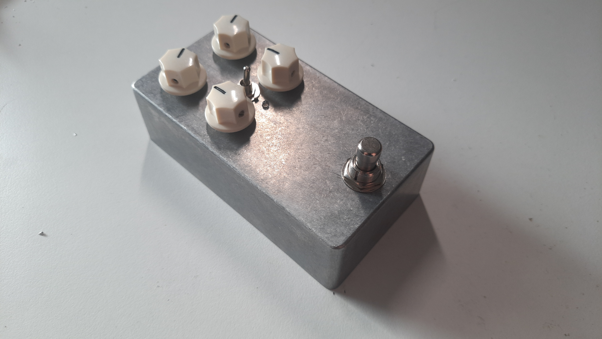
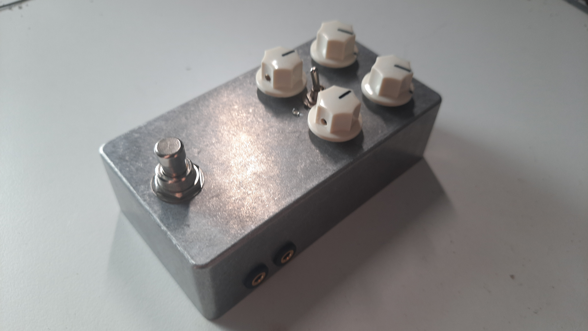
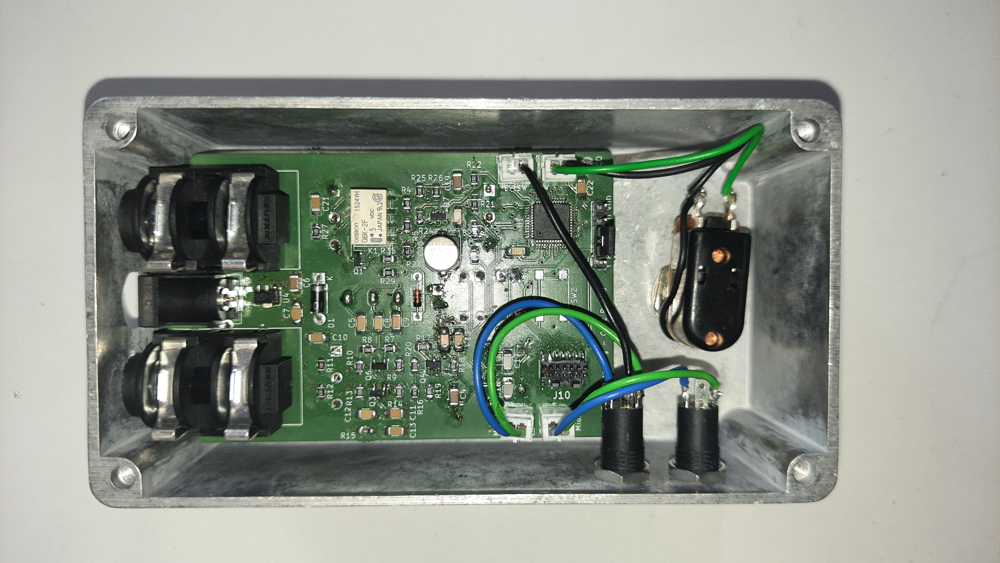
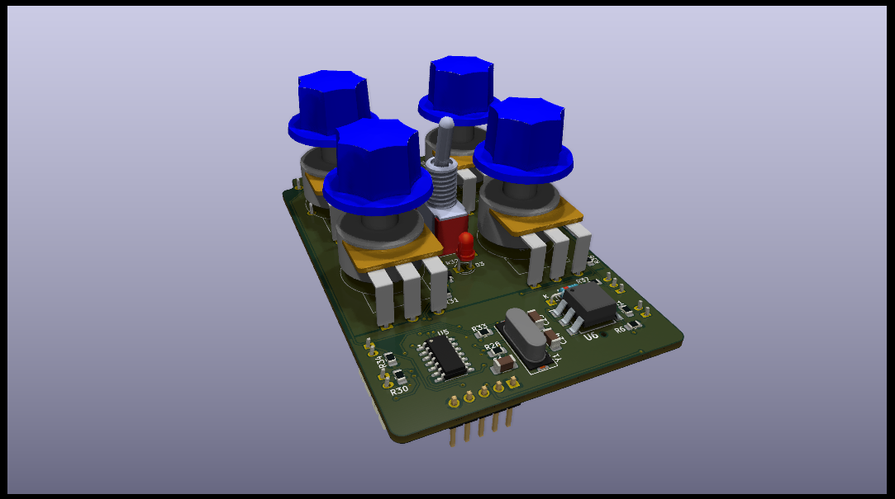
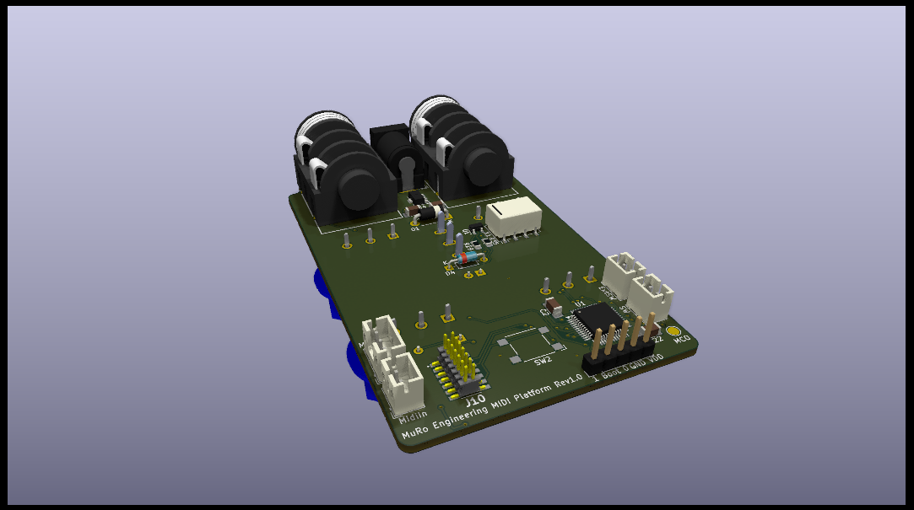
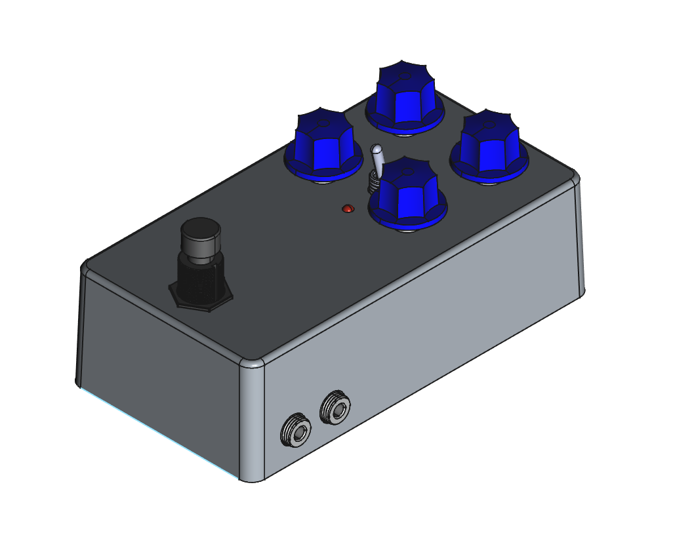
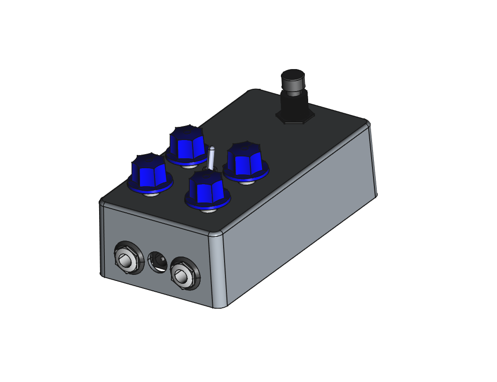
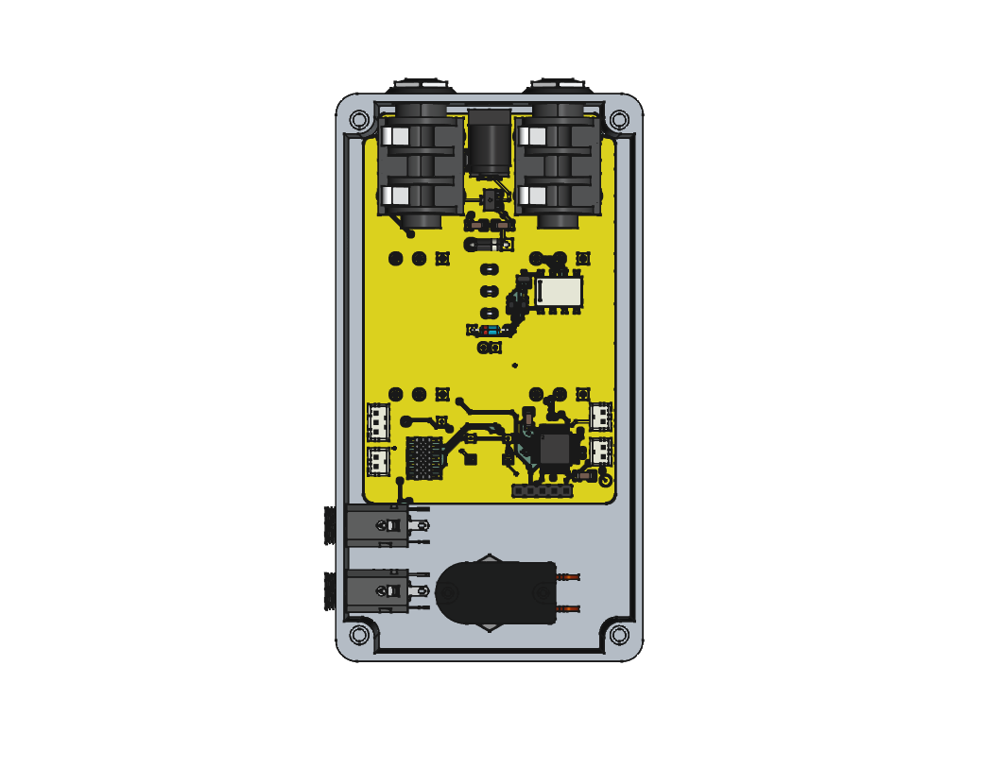

# MidiPedalPlatform

## Introduction

This project contains a template PCB for guitar effect pedals with MIDI remote functionality. MIDI is implemented using a STM32 F030C8T6 microcontroller.
The PCB is setup to contain four 16mm potentiometers, a SPST on-off-on switch and PCB mounted jack sockets for audio connection. Further connections are the MIDI input and output, an internal switch and an external switch which are all accesible through JST connectors. A programming and debugging connector for the STLINK-V3MINIE is implemented on the PCB.

Following images show a complete pedal build based on this template.





## PCB

The PCB was developed using KiCad and a two layer setup. The KiCad project can be found in [PCB/MidiPedalPlatform](PCB/MidiPedalPlatform) whilst PCB and schematic exports are located in [PCB/Export](PCB/Export).




## Firmware

The MCU firmware is located in the [Firmware](Firmware) directory. It is implemented as STM32CubeIDE project.

The firmware handles switches and MIDI messages. By default, two switches are available: SW and ExtSW. SW is meant to be used as the default internal footswitch and must be a momentary switch. ExtSW can be used to connect an external remote switch and is by default configured to be a latching switch. This can be changed by changing:
```C
bool swLatches[NO_SWITCHES] = { false, true, true }
```
to
```C
bool swLatches[NO_SWITCHES] = { false, false, true }
```
The pedal can be switched on and off via MIDI CC commands. The channel and controller number are stored in the flash memory. Thus, a MIDI learn state and a reset state have been implemented.
To reset both parameters to their default value (channel=0, controller=20), hold the footswitch pressed (SW) while powering on or reseting the MCU till the LED starts blinking. Release the switch afterwards and the LED stops blinking. Default values will then have been written to flash.

MIDI learn is used to set any other channel and controller. This mode can be accessed by holding the footswitch pressed whilst the input jack is not connected. The LED starts blinking once MIDI learn state has been reached. In this mode, the firmware waits for a MIDI CC message and once the first one has been received, it will store the channel and controller of this message in the flash memory. MIDI learn can be aborted by pressing the footswitch again. In either case, MIDI CC received or MIDI learn aborted, the LED stops blinking.
The pedal can be switched on by sending a value greater than 63 to the configured MIDI contoller. Anything lower or equal than 63 will switch off the pedal.

The footswitch can be used in two different ways. 

- Normal activation: Toggles between on and off state
- Keeping the switch pressed whilst the pedal was off: The pedal will turn on as long you keep the switch pressed. Once release, the pedal will turn off.

## Enclosure

The PCB was design to fit into a 1590N1 enclosure. A FreeCAD project including enclosure, PCB, jacks and the switch can be found at [Enclosure/Enclosure.FCStd](Enclosure/Enclosure.FCStd). Renderings of the enclosure can be found below.
Drill templates can be found in [Enclosure/DrillTemplates](Enclosure/DrillTemplates).






